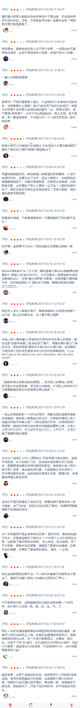
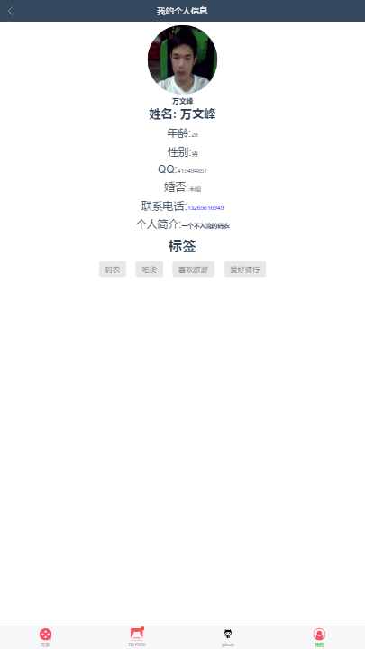

# vue2-douban 一个使用vue2编写的豆瓣影评

> vue2 douban
## 截图





## 编译运行
``` bash
# 安装
npm install

# 运行 localhost:8080
npm run dev

# build for production with minification
npm run build

# build for production and view the bundle analyzer report
npm run build --report

```
